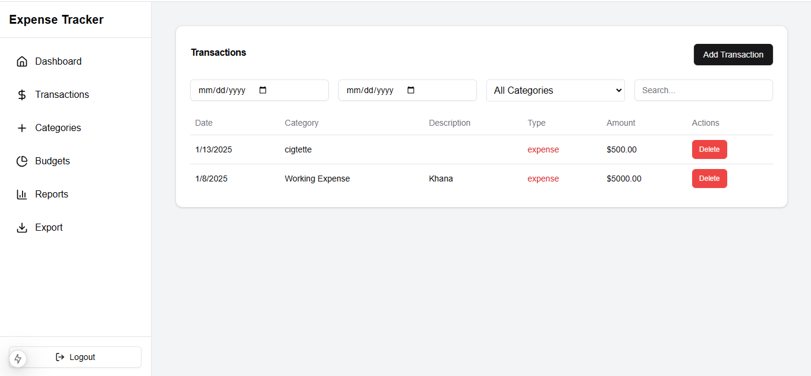
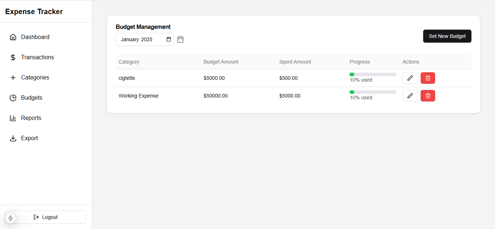
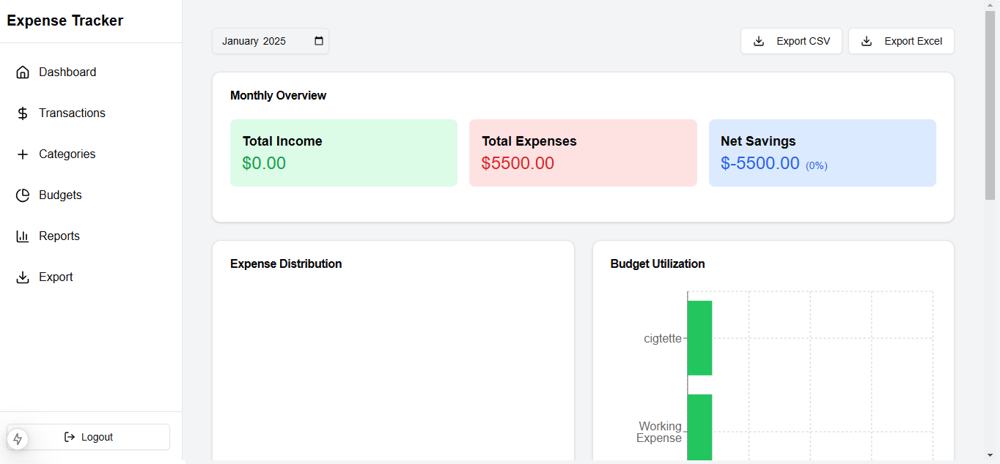

# ExpenseTracker

A full-stack expense tracking application with budget management, transaction tracking, and financial reporting capabilities.

## Table of Contents
- [Features](#features)
- [Tech Stack](#tech-stack)
- [Prerequisites](#prerequisites)
- [Installation](#installation)
  - [Database Setup](#database-setup)
  - [Backend Setup](#backend-setup)
  - [Frontend Setup](#frontend-setup)
- [Project Structure](#project-structure)
- [Screenshots](#screenshots)

## Features

- 👤 User authentication and authorization
- 💰 Transaction management (income & expenses)
- 📊 Budget planning and tracking
- 📈 Financial reports and analytics
- 🗂️ Category management
- 📅 Monthly and yearly summaries
- 📱 Responsive design

## Tech Stack

### Backend
- Node.js
- Express.js
- PostgreSQL
- JWT Authentication
- bcrypt.js

### Frontend
- React.js
- Tailwind CSS
- Recharts for visualization
- React Router DOM

## Prerequisites

Before you begin, ensure you have the following installed:
- Node.js (v14 or higher)
- npm (v6 or higher)
- PostgreSQL (v13 or higher)
- Git

## Installation

### Database Setup

1. Install PostgreSQL:
   ```bash
   # For Ubuntu/Debian
   sudo apt update
   sudo apt install postgresql postgresql-contrib

   # For macOS using Homebrew
   brew install postgresql

   # For Windows
   # Download and install from https://www.postgresql.org/download/windows/
   ```

2. Start PostgreSQL service:
   ```bash
   # For Ubuntu/Debian
   sudo service postgresql start

   # For macOS
   brew services start postgresql

   # For Windows
   # PostgreSQL service starts automatically
   ```

3. Create database and user:
   ```sql
   -- Login to PostgreSQL
   psql -U postgres

   -- Create database
   CREATE DATABASE expensetracker;

   -- Create user
   CREATE USER expenseuser WITH ENCRYPTED PASSWORD 'yourpassword';

   -- Grant privileges
   GRANT ALL PRIVILEGES ON DATABASE expensetracker TO expenseuser;
   ```

4. Create required tables:
   ```sql
   -- Connect to database
   \c expensetracker

   -- Users table
   CREATE TABLE users (
     id SERIAL PRIMARY KEY,
     name VARCHAR(100) NOT NULL,
     email VARCHAR(100) UNIQUE NOT NULL,
     password VARCHAR(255) NOT NULL,
     created_at TIMESTAMP DEFAULT CURRENT_TIMESTAMP
   );

   -- Categories table
   CREATE TABLE categories (
     id SERIAL PRIMARY KEY,
     name VARCHAR(100) NOT NULL,
     user_id INTEGER REFERENCES users(id),
     created_at TIMESTAMP DEFAULT CURRENT_TIMESTAMP
   );

   -- Transactions table
   CREATE TABLE transactions (
     id SERIAL PRIMARY KEY,
     user_id INTEGER REFERENCES users(id),
     category_id INTEGER REFERENCES categories(id),
     amount DECIMAL(10,2) NOT NULL,
     type VARCHAR(10) NOT NULL,
     description TEXT,
     date DATE NOT NULL,
     created_at TIMESTAMP DEFAULT CURRENT_TIMESTAMP
   );

   -- Budgets table
   CREATE TABLE budgets (
     id SERIAL PRIMARY KEY,
     user_id INTEGER REFERENCES users(id),
     category_id INTEGER REFERENCES categories(id),
     amount DECIMAL(10,2) NOT NULL,
     month DATE NOT NULL,
     created_at TIMESTAMP DEFAULT CURRENT_TIMESTAMP,
     UNIQUE(user_id, category_id, month)
   );
   ```

### Backend Setup

1. Clone the repository:
   ```bash
   git clone https://github.com/yourusername/expensetracker.git
   cd expensetracker
   ```

2. Navigate to backend directory and install dependencies:
   ```bash
   cd backend
   npm install
   ```

3. Create .env file:
   ```bash
   cp .env.example .env
   ```

4. Configure environment variables in .env:
   ```
   PORT=5000
   NODE_ENV=development
   DB_HOST=localhost
   DB_PORT=5432
   DB_NAME=expensetracker
   DB_USER=expenseuser
   DB_PASSWORD=yourpassword
   JWT_SECRET=your_jwt_secret_key
   ```

5. Start the backend server:
   ```bash
   # Development mode
   npm run dev

   # Production mode
   npm start
   ```

### Frontend Setup

1. Navigate to frontend directory and install dependencies:
   ```bash
   cd ../frontend
   npm install
   ```

2. Create .env file:
   ```bash
   cp .env.example .env
   ```

3. Configure environment variables in .env:
   ```
   REACT_APP_API_URL=http://localhost:5000/api
   ```

4. Start the frontend application:
   ```bash
   npm start
   ```

The application should now be running on:
- Backend: http://localhost:5000
- Frontend: http://localhost:3000

## Project Structure

### Backend Structure
```
backend/
├── config/
│   └── db.js
├── controllers/
│   ├── authController.js
│   ├── budgetController.js
│   ├── categoryController.js
│   ├── reportController.js
│   └── transactionController.js
├── middleware/
│   └── auth.js
├── routes/
│   ├── auth.js
│   ├── budget.js
│   ├── category.js
│   ├── report.js
│   └── transaction.js
└── app.js
```

### Frontend Structure
```
frontend/
├── public/
├── src/
│   ├── components/
│   ├── contexts/
│   ├── hooks/
│   ├── pages/
│   ├── services/
│   ├── utils/
│   └── App.js
└── package.json
```

## Screenshots

### Dashboard


Track your expenses, income, and budget progress at a glance.

### Transactions

Manage and filter your transactions with ease.

### Budget Management

Set and monitor your budgets by category.

### Reports

Visualize your financial data with interactive charts and reports.

## API Documentation

### Authentication Endpoints
- POST `/api/auth/signup` - Register new user
- POST `/api/auth/login` - Login user

### Transaction Endpoints
- GET `/api/transactions` - Get all transactions
- POST `/api/transactions` - Create new transaction
- PUT `/api/transactions/:id` - Update transaction
- DELETE `/api/transactions/:id` - Delete transaction

### Budget Endpoints
- GET `/api/budgets` - Get all budgets
- POST `/api/budgets` - Create new budget
- PUT `/api/budgets/:id` - Update budget
- DELETE `/api/budgets/:id` - Delete budget

### Category Endpoints
- GET `/api/categories` - Get all categories
- POST `/api/categories` - Create new category
- PUT `/api/categories/:id` - Update category
- DELETE `/api/categories/:id` - Delete category

### Report Endpoints
- GET `/api/reports/monthly` - Get monthly summary
- GET `/api/reports/yearly` - Get yearly summary
- GET `/api/reports/category-expenses` - Get category-wise expenses
- GET `/api/reports/spending-trends` - Get spending trends
- GET `/api/reports/budget-comparison` - Get budget comparison

## Disclaimer & Connect with Me

This project was developed as a portfolio piece to demonstrate full-stack development capabilities. While it implements core functionalities and security measures, it may not include all production-level best practices and optimizations. The main focus was on learning and showcasing the following:

- Full-stack application architecture
- RESTful API development
- Database design and management
- User authentication and authorization
- Frontend state management
- Data visualization

### 🚀 Areas for Improvement
- Additional input validations
- Comprehensive error handling
- Unit and integration tests
- Code documentation
- Performance optimizations
- Accessibility features

### 🤝 Let's Connect!
If you'd like to discuss this project, provide feedback, or explore collaboration opportunities, feel free to connect with me on LinkedIn:

[](https://www.linkedin.com/in/follow-muhammadfaizan/)

I'm always open to learning from the community and improving my development skills!

---
⭐ If you find this project helpful or interesting, consider giving it a star!